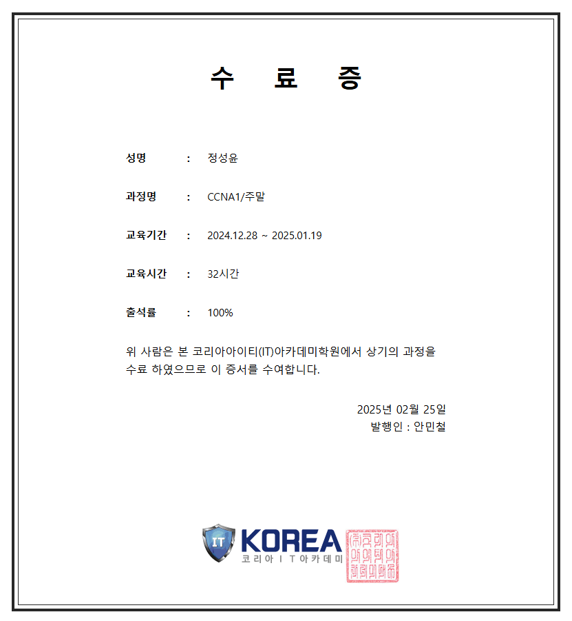
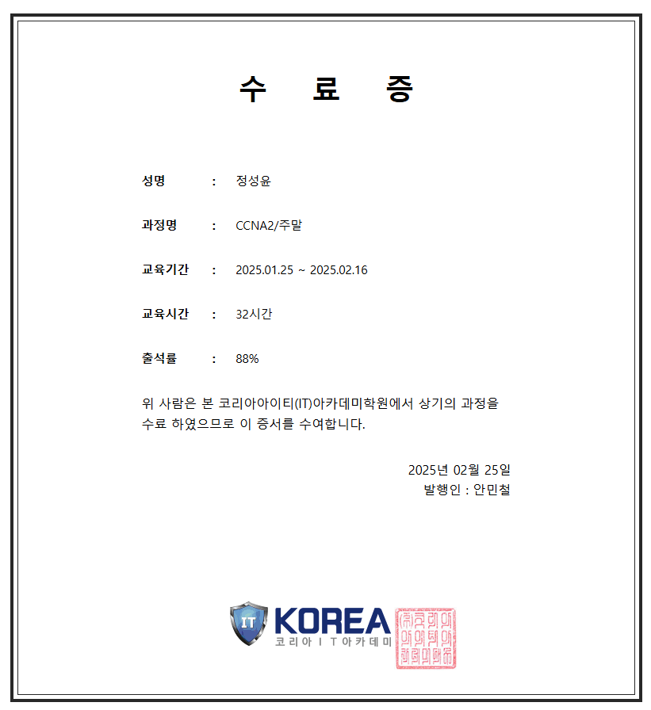

# CCNA
NETWORK STUDY
INDEX
---
|-|-|-|
|-|-|-|
|Index|바로가기|-|
|Ch.1(OSI계층)|[바로가기](./Ch.1(OSI계층))|-|
|Ch.2(케이블링,IPv4)|[바로가기](./Ch.2(케이블링,IPv4))|-|
|Ch.3(ICMP,ARP,Routing protocol(정적))|[바로가기](./Ch.3(ICMP,ARP,Routing%20protocol(정적)))|-|
|Ch.4(Routing Protocol(정적, 동적)|[바로가기](./Ch.4(Routing%20Protocol(정적,%20동적)))|-|
|Ch.5(RIP,OSPF)|[바로가기](./Ch.5(RIP,OSPF))|-|
|Ch.6(EIGRP&서브네팅)|[바로가기](./Ch.6(EIGRP&서브네팅))|-|
|Ch.7(서브네팅,VLSM,축약)|[바로가기](./Ch.7(서브네팅,VLSM,축약))|-|
|Ch.8(VLAN(스위치))|[바로가기](./Ch.8(VLAN(스위치)))|-|
|Ch.9(VLAN(router에서)&STP)|[바로가기](./Ch.9(VLAN(router에서)&STP))|-|
|Ch.10(ACL)|[바로가기](./Ch.10(ACL))|-|
|Ch.11(NAT)|[바로가기](./Ch.11(NAT))|-|
|Ch.12(Port security&DTP-VTP)|[바로가기](./Ch.12(Port%20security&DTP-VTP))|-|
|Ch.13(EthernetChannel&L3Switch)|[바로가기](./Ch.13(EthernetChannel&L3Switch))|-|
|Ch.14(FHRP)|[바로가기](./Ch.14(FHRP))|-|

---
> 수료증

